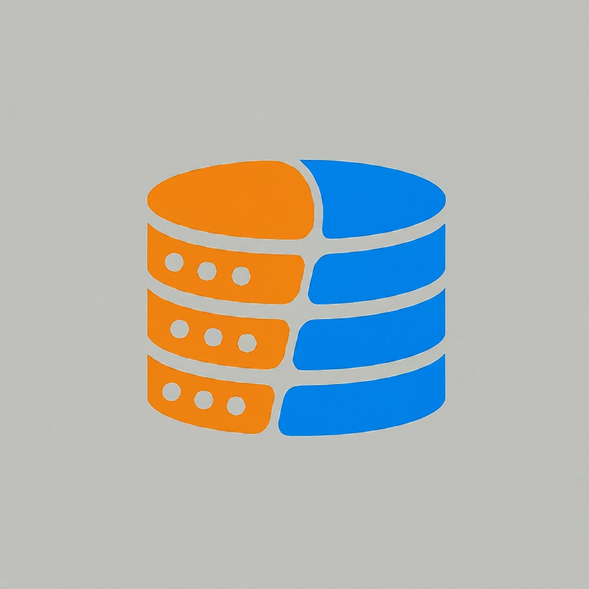

<a name="readme-top"></a>

[![Contributors][contributors-shield]][contributors-url]
[![Forks][forks-shield]][forks-url]
[![Stargazers][stars-shield]][stars-url]
[![Issues][issues-shield]][issues-url]
[![LinkedIn][linkedin-shield]][linkedin-url]
[![GPU License][license-shield]][license-url]


<!-- PROJECT LOGO -->
<br />
<div align="center">
  <a href="https://github.com/d-pamneja/Text_to_SQL_Application">
    
  </a>

<h3 align="center">Text to SQL Generation using Google Gemini</h3>

  <p align="center">
    The aim of this project is to take a text question from the user, convert them into a actionable SQL query, and then query a given database based on the text input from the user.
    <br />
    <br />
    <a href="https://github.com/d-pamneja/Text_to_SQL_Application/issues">Report Bug</a>
    ·
    <a href="https://github.com/d-pamneja/Text_to_SQL_Application/issues">Request Feature</a>
  </p>
</div>


<!-- TABLE OF CONTENTS -->
<details>
  <summary>Table of Contents</summary>
  <ol>
    <li>
      <a href="#about-the-project">About The Project</a>
      <ul>
        <li><a href="#built-with">Built With</a></li>
      </ul>
    </li>
    <li><a href="#deployment">Deployment</a></li>
    <li><a href="#contributing">Contributing</a></li>
    <li><a href="#contact">Contact</a></li>
  </ol>
</details>


<!-- ABOUT THE PROJECT -->
## About The Project

[![Product Name Screen Shot][product-screenshot]](https://example.com)

In this project, we have leveraged the capabilities of Google Gemini models and API to generate the output from a SQL Database based on a text question given by the user. The project aims to simplify the process of accessing databases and performing operations on SQL based, without neccessarily knwoing how to write or read SQL commands. Thus, it helps in saving time and effort for multiple stakeholders, as well as allowing non-technical persons to interact with the database. By utilizing advanced natural language processing (NLP) models, the application can extract the exact information needed by the user and formulate a relevant SQL command and execute the same on any given database. 

The user can type in their query and hit the database running, allowing this to be a seamless experience. The application can be used in various domains, including education, business, and research, to streamline the process of querying databases and extracting information.

<p align="right">(<a href="#readme-top">back to top</a>)</p>


### Built With


* [![google-gemini][google-gemini]][google-gemini-url]
* [![sqlite][sqlite]][sqlite-url]

<p align="right">(<a href="#readme-top">back to top</a>)</p>


<!-- DEPLOYMENT -->
## Deployment
The application is deployed via Hugging face spaces. That can be achieved by following the steps below:

1. First, create an account on Hugging Face Spaces and log in to the account. The link to the website is [here](https://huggingface.co/spaces).

2. Next, create a new space by clicking on the "Create Space" button on the top right corner of the screen. Fill in the details for the space and click on "Create Space".

3. Push all your code to the Hugging Face repository by running the following command in the terminal:

```sh

git clone https://huggingface.co/spaces/"Your Repository Name"
git add .
git commit -m "Initial Commit"
git push -u origin main

``` 

The application should now be deployed on the Hugging Face Spaces platform. You can access the application by clicking on the "Open in Spaces" button on the top right corner of the screen. You can also share the link to the application with others by clicking on the "Share" button on the top right corner of the screen.


<p align="right">(<a href="#readme-top">back to top</a>)</p>

<!-- CONTRIBUTING -->
## Contributing

I'm thrilled to have you exploring my project! This endeavor is a collective effort, and we believe that every contribution adds value and creativity to our community.

How You Can Contribute:

🛠️ Found a bug? Have an idea for improvement? Fork the repo and create a pull request.

💡 Have a suggestion for making this project even better? Open an issue with the "enhancement" tag.

⭐ Like what you see? Show your support by giving our project a star!

Remember, your contributions, whether big or small, are incredibly valuable to us. They help us learn, inspire, and create a better project together.


1. Fork the Project
2. Create your Feature Branch (`git checkout -b feature/AmazingFeature`)
3. Commit your Changes (`git commit -m 'Add some AmazingFeature'`)
4. Push to the Branch (`git push origin feature/AmazingFeature`)
5. Open a Pull Request

Thank you for being a part of this journey!

<p align="right">(<a href="#readme-top">back to top</a>)</p>


<!-- CONTACT -->
## Contact

Dhruv Pamneja - dpamneja@gmail.com / 21f1001719@ds.study.iitm.ac.in

Project Link: [https://github.com/d-pamneja/Text_to_SQL_Application](https://github.com/d-pamneja/Text_to_SQL_Application)

<p align="right">(<a href="#readme-top">back to top</a>)</p>


<!-- MARKDOWN LINKS & IMAGES -->
<!-- https://www.markdownguide.org/basic-syntax/#reference-style-links -->
[contributors-shield]: https://img.shields.io/github/contributors/d-pamneja/Text_to_SQL_Application.svg?style=for-the-badge
[contributors-url]: https://github.com/d-pamneja/Text_to_SQL_Application/graphs/contributors
[forks-shield]: https://img.shields.io/github/forks/d-pamneja/Text_to_SQL_Application.svg?style=for-the-badge
[forks-url]: https://github.com/d-pamneja/Text_to_SQL_Application/network/members
[stars-shield]: https://img.shields.io/github/stars/d-pamneja/Text_to_SQL_Application.svg?style=for-the-badge
[stars-url]: https://github.com/d-pamneja/Text_to_SQL_Application/stargazers
[issues-shield]: https://img.shields.io/github/issues/d-pamneja/Text_to_SQL_Application.svg?style=for-the-badge
[issues-url]: https://github.com/d-pamneja/Text_to_SQL_Application/issues
[license-shield]: https://img.shields.io/github/license/d-pamneja/Text_to_SQL_Application.svg?style=for-the-badge
[license-url]: LICENSE
[linkedin-shield]: https://img.shields.io/badge/-LinkedIn-black.svg?style=for-the-badge&logo=linkedin&colorB=555
[linkedin-url]: https://www.linkedin.com/in/dhruv-pamneja-3b8432187/
[product-screenshot]: static/screenshot.png
[Next.js]: https://img.shields.io/badge/next.js-000000?style=for-the-badge&logo=nextdotjs&logoColor=white
[Next-url]: https://nextjs.org/
[React.js]: https://img.shields.io/badge/React-20232A?style=for-the-badge&logo=react&logoColor=61DAFB
[React-url]: https://reactjs.org/
[Vue.js]: https://img.shields.io/badge/Vue.js-35495E?style=for-the-badge&logo=vuedotjs&logoColor=4FC08D
[Vue-url]: https://vuejs.org/
[Angular.io]: https://img.shields.io/badge/Angular-DD0031?style=for-the-badge&logo=angular&logoColor=white
[Angular-url]: https://angular.io/
[Svelte.dev]: https://img.shields.io/badge/Svelte-4A4A55?style=for-the-badge&logo=svelte&logoColor=FF3E00
[Svelte-url]: https://svelte.dev/
[Laravel.com]: https://img.shields.io/badge/Laravel-FF2D20?style=for-the-badge&logo=laravel&logoColor=white
[Laravel-url]: https://laravel.com
[Bootstrap.com]: https://img.shields.io/badge/Bootstrap-563D7C?style=for-the-badge&logo=bootstrap&logoColor=white
[Bootstrap-url]: https://getbootstrap.com
[JQuery.com]: https://img.shields.io/badge/jQuery-0769AD?style=for-the-badge&logo=jquery&logoColor=white
[JQuery-url]: https://jquery.com 
[Pandas]: https://img.shields.io/badge/pandas-%23150458.svg?style=for-the-badge&logo=pandas&logoColor=white
[Pandas-url]: https://pandas.pydata.org
[scikit-learn]: https://img.shields.io/badge/scikit--learn-%23F7931E.svg?style=for-the-badge&logo=scikit-learn&logoColor=white
[scikit-learn-url]: https://scikit-learn.org/stable/
[openai]: https://img.shields.io/badge/OpenAI-5A5A5A?style=for-the-badge&logo=openai&logoColor=white
[openai-url]: https://openai.com
[langchain]: https://img.shields.io/badge/Langchain-FF2D20?style=for-the-badge&logo=langchain&logoColor=white
[langchain-url]: https://langchain.com
[ google-gemini] : https://img.shields.io/badge/Google_Gemini-FF2D20?style=for-the-badge&logo=google&logoColor=white
[ google-gemini-url]: https://gemini.google.com/app/bdfb4a3a241df0d4
[sqlite]: https://img.shields.io/badge/SQLite-07405E?style=for-the-badge&logo=sqlite&logoColor=white
[sqlite-url]: https://www.sqlite.org/index.html
